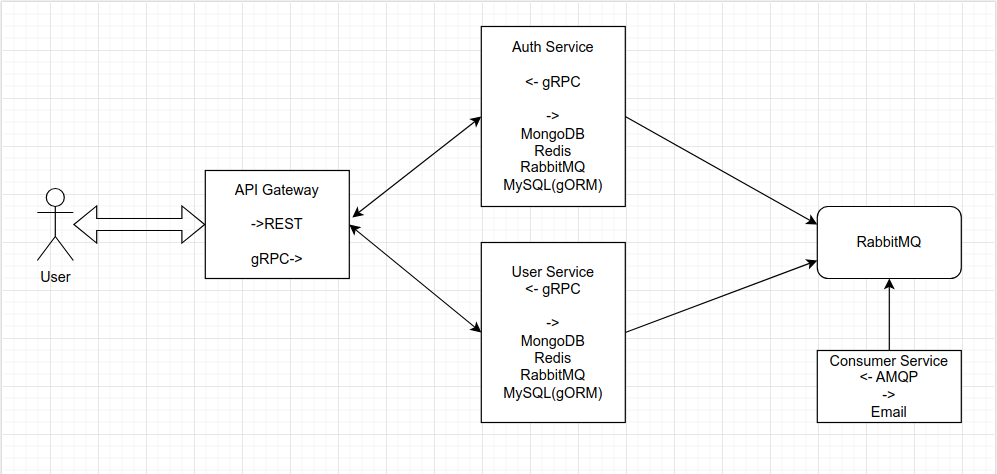
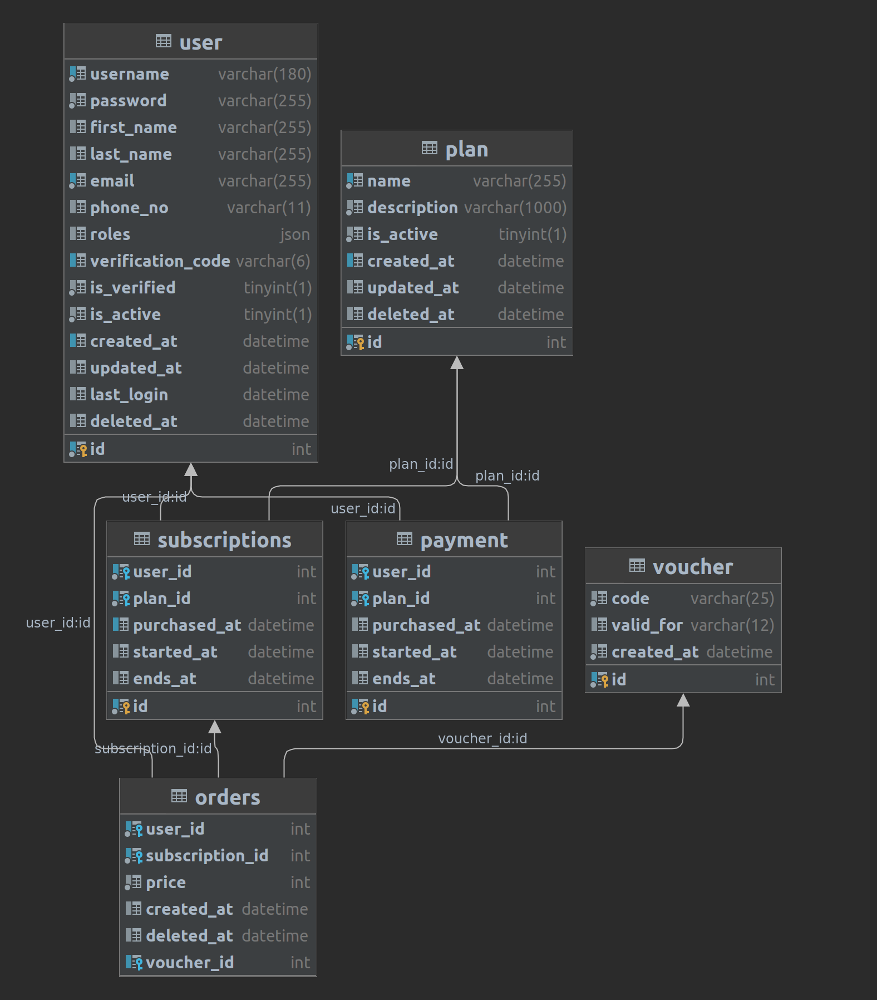
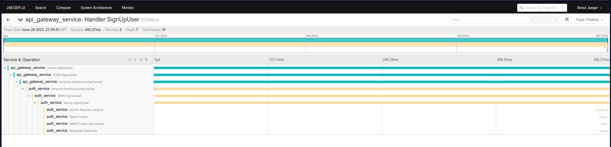
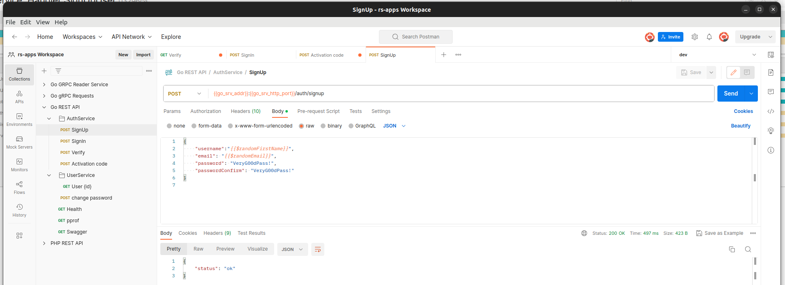

## Golang monorepo with REST, gRPC, CQRS, opentelemetry, gorillaMUX, swag, mailhog and rabbitMQ 
#### based on docker containers, docker compose, Makefile 

## Topics Covered
- REST, gRPC, CQRS, Docker, distributed tracing (jaeger, otel, prometheus,grafana, NewRelics), testify
- Onion, Clean architecture, Monorepo,
- Swagger, Postman docs ([/docs](docs) directory)
- JWT , auth and logging middleware
- Env with Viper
- hot reload with cosmtrek/air
- golangcilint, pre-commit-hooks
- MySQL, database/sql, gorm
- Redis
- MongoDB
- Jenkins, GitHub actions
  Plans:
- .gitlabci, buildspec
- mockery for testify, more tests

## Services:

- ### API Gateway
  - Backend For Frontend approach, gateway takes HTTP requests and decide which service over gRPC should be called
    - security & Auth methods 
      - Basic Auth
      - Bearer Token
      - API key
      - JWT
    - HTTP Handlers based on GorillaMux
    - Router with middlewares
      - content_type
      - correlation_id
      - CORS
      - JWT Token decode
      - request_log
    - CQRS
      - separated commands and queries that connect to specific services
        - example commands: signup, change_password
        - example queries: sign_in, user_details, get_verification_code
- ### Auth service
  - gRPC server for commands:
    - SignIn
    - SignUp
    - Verify  account code
  - Service layer to manage data flow
    - rpc -> service -> repositories -> clients
  - Redis cache to prevent eventual consistency
  - MongoDB for users & logs storage
  - MySQL as main RDBMS for users
  - RabbitMQ direct queue with dead letter exchange for email sendout
- ### User service
  - gRPC server for commands 
    - get user(id)
    - get user details
    - change password
  - Mysql repository based on gORM
  - Redis cache for cacheable users
- ### Consumer service
  - AMQP consumer that read events from rabbitMQ, send emails and store logs in mongoDB

- ### Tester service
  - workers pool service that constantly creates users from registration, activation and signIn for JWT Tokens
  - optional daisy chain pattern for concurrency controll
  

## Build
make build

make up

## Run tests
make test_unit

make test_integration

### gRPC
- make proto

## Credentials
#### services
- interview@interview.com:VeryG00dPass!

screenshots:

